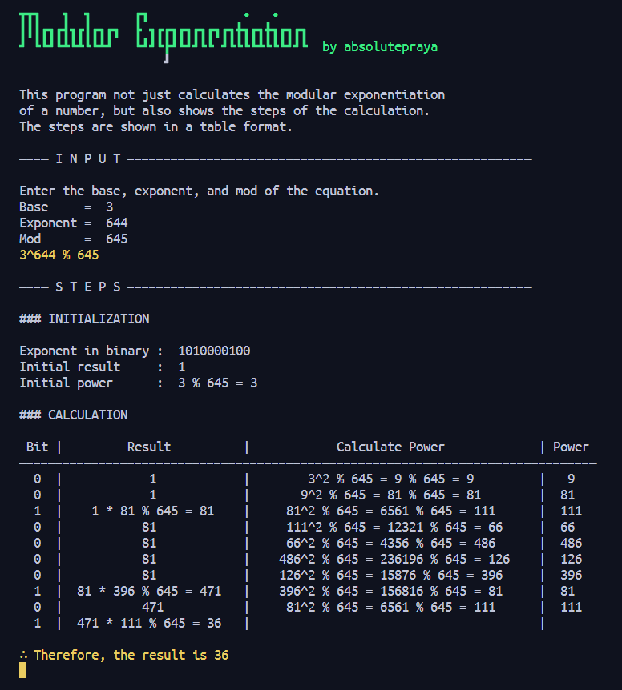

# Discrete Mathematics 2 Calculator with Steps

This is not just a simple calculator, but a calculator that also provide step-by-step solutions (might as well call it a solver) for the following topics:
- Modular Exponentiation
- Trial Division
- GCD Euclidean (soon)
- GCD Benzout (soon)
and more to come.

## Dependencies

- Python 3.7 or higher
- Python Standard Library

## How to Use

1. Clone the repository  
`git clone https://github.com/absolutepraya/dm2-calculator.git`

2. Change directory to the repository  
`cd dm2-calculator`

3. Run the Python calculator  
`python [Calculator_Name].py`  
 OR  
 use command line arguments:  
__\# For Modular Exponentiation calculator__  
`python modular_exponentiation.py [base] [exponent] [modulus]`  
__\# For Trial Division calculator__  
`python trial_division.py [number]`  
__\# For GCD Euclidean calculator__  
`(soon)`  
__\# For GCD Benzout calculator__  
`(soon)`  
__\# and more to come__