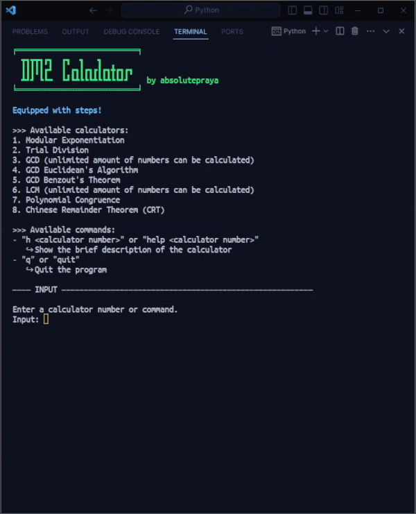
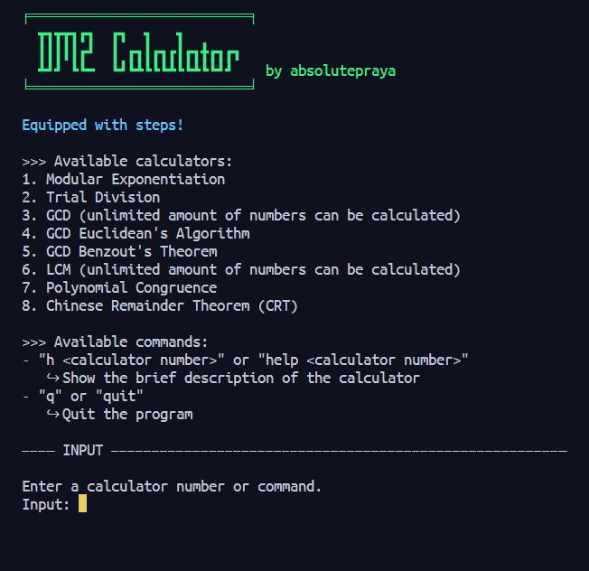
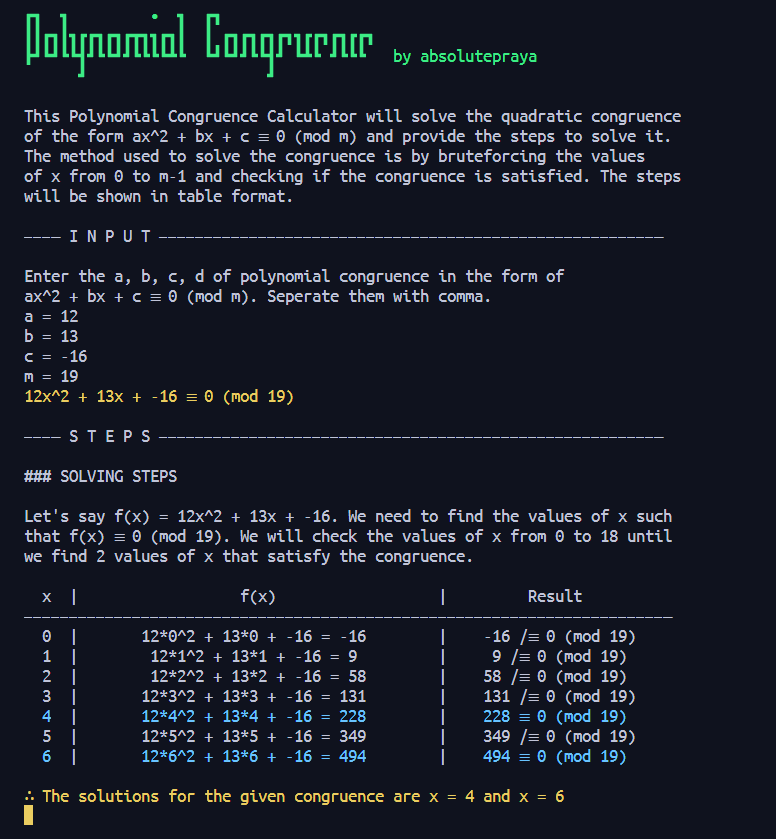
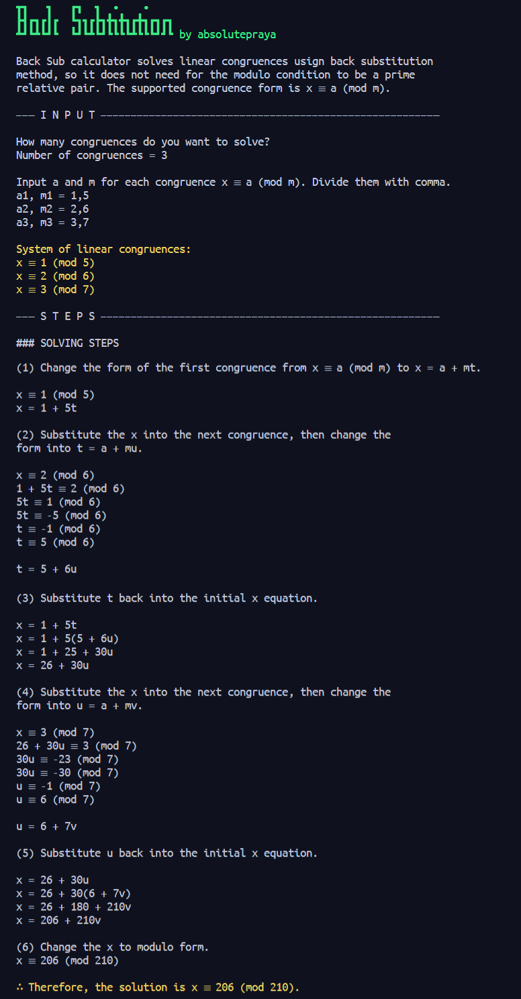

# Discrete Mathematics 2 Calculator with Steps

This is not just a simple calculator, but a calculator that also provide ***step-by-step solutions*** for the following topics:

1. Modular Exponentiation
2. Trial Division
3. GCD + Pairwise Prime
4. GCD Euclidean's Algorithm
5. GCD Benzout's Theorem
6. LCM
7. Polynomial Congruence
8. Chinese Remainder Theorem (CRT)
9. Back Substitution

and more to come.

**Features:**  
✅ Step-by-step solutions  
✅ Seamless and easy to use  
✅ Clears the terminal after each calculation for better readability  
✅ No need to use internet connection  
✅ No need to install any dependencies other than Python

**Demo:**

[Check the screenshots](#screenshots)

The main purpose of this project is to help students who are studying Discrete Mathematics 2 to understand the steps of each calculation, or teachers who want to provide a better understanding for their students.

Please do note that this project is still in its early stage, so there might be some bugs and errors. If you find any, please let me know by creating an issue.

## Dependencies

- Python 3.7 or higher
- Python Standard Library

If you don't have Python installed, you can download it from [Python's official website](https://www.python.org/downloads/).

## How to Use

1. Open your terminal and clone the repository  
`git clone https://github.com/absolutepraya/dm2-calculator.git`

2. Change directory to the repository  
`cd dm2-calculator`

3. Run the main file, then you can choose which calculator you want to use inside it  
`python main.py`

Remember that the `main.py` file must be in the same directory as the `Calculators` directory.

If you encounter any error when running the `main.py` file, try redownloading the repository, and run the main file without any modification.

## Screenshots

| **Main Menu** |
|---------|
|  |

| **Modular Exponentiation** | **Trial Division** |
|---------|---------|
|  |  |

| **GCD** | **GCD Euclidean's Algorithm** |
|---------|---------|
|  |  |

| **GCD Bezout's Theorem** | **LCM** |
|---------|---------|
|  |  |

| **Polynomial Congruence** | **Chinese Remainder Theorem (CRT)** |
|---------|---------|
|  |  |

| **Back Substitution** | **—** |
|---------|---------|
|  |  |

## Change Log

Version 1.70:
- Added error handlers and input validations everywhere

## Future Updates (To-Do)

- Create more calculators along the time
- Add .txt log file to store the history of each calculation
