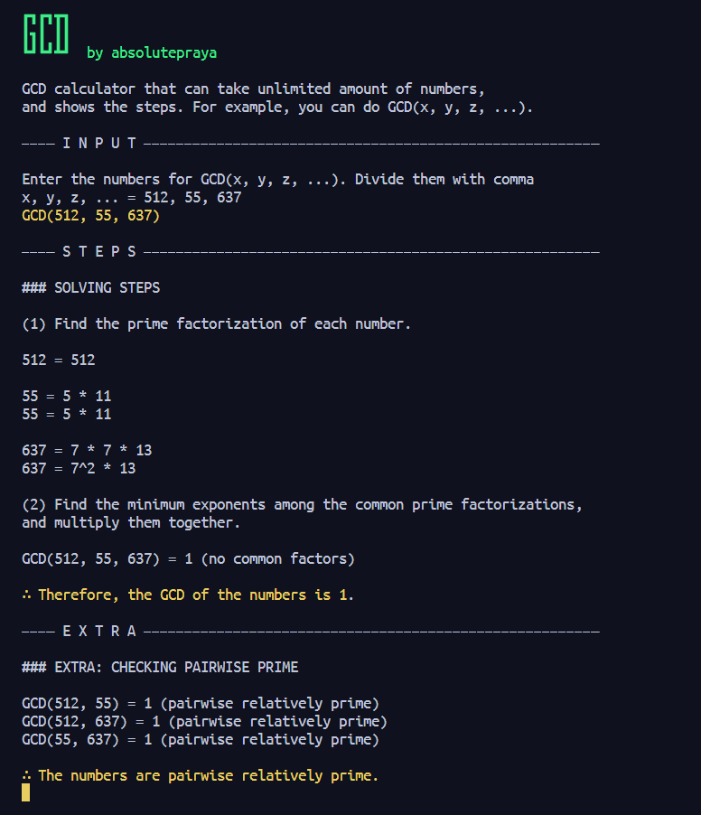

# Discrete Mathematics 2 Calculator with Steps

This is not just a simple calculator, but a calculator that also provide ***step-by-step solutions*** (might as well call it a solver) for the following topics:
- Modular Exponentiation
- Trial Division
- GCD with Pairwise Prime (unlimited amount of numbers can be calculated)
- GCD Euclidean's Algorithm
- GCD Benzout's Theorem
- LCM (unlimited amount of numbers can be calculated)

and more to come.

[Check the screenshots](#screenshots)

Please do note that this project is still in its early stage, so there might be some bugs and errors. If you find any, please let me know by creating an issue.

## Dependencies

- Python 3.7 or higher
- Python Standard Library

## How to Use

1. Open your terminal and clone the repository  
`git clone https://github.com/absolutepraya/dm2-calculator.git`

2. Change directory to the repository  
`cd dm2-calculator`

3. Run the desired Python calculator  
`python [Calculator_Name].py`  
or [check the command line arguments](#command-line-arguments)

## Command Line Arguments

- For Modular Exponentiation calculator  
`python Modular_Exponentiation.py [base] [exponent] [modulus]`  

- For Trial Division calculator  
`python Trial_Division.py [number]`  

- For GCD calculator  
`python GDC.py [number1] [number2] [number3] ...`

- For GCD Euclidean's Algorithm calculator  
`python GDC_Euclidean.py [number1] [number2]`  

- For GCD Benzout's Theorem calculator  
`python GDC_Benzout.py [number1] [number2]`   

- For LCM calculator  
`python LCM.py [number1] [number2] [number3] ...` 

- For Chinese Remainder Theorem (CRT) calculator,  the supported form is x ≡ a (mod n)  
`python CRT.py a1,n1 a2,n2 a3,n3 ...`

## Screenshots

| **Modular Exponentiation** | **Trial Division** |
|---------|---------|
|  |  |

| **GCD** | **GCD Euclidean's Algorithm** |
|---------|---------|
|  |  |

| **GCD Bezout's Theorem** | **LCM** |
|---------|---------|
|  |  |

| **Chinese Remainder Theorem (CRT)** |
|---------|
|  |

## Future Plan

- Add more calculators along the time
- Make the it runs indefinitely until the user decides to exit
- Package the calculator using \_\_init__ and \_\_main__