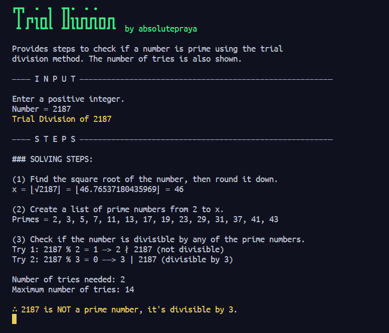

# Discrete Mathematics 2 Calculator with Steps

This is not just a simple calculator, but a calculator that also provide ***step-by-step solutions*** (might as well call it a solver) for the following topics:
- Modular Exponentiation
- Trial Division
- GCD with Pairwise Prime (unlimited amount of numbers can be calculated)
- GCD Euclidean's Algorithm
- GCD Benzout's Theorem
- LCM (unlimited amount of numbers can be calculated)

and more to come.

[Check the screenshots](#screenshots)

## Dependencies

- Python 3.7 or higher
- Python Standard Library

## How to Use

1. Open your terminal and clone the repository  
`git clone https://github.com/absolutepraya/dm2-calculator.git`

2. Change directory to the repository  
`cd dm2-calculator`

3. Run the desired Python calculator  
`python [Calculator_Name].py`  
 OR  
 use command line arguments:  
__\# For Modular Exponentiation calculator__  
`python Modular_Exponentiation.py [base] [exponent] [modulus]`  
__\# For Trial Division calculator__  
`python Trial_Division.py [number]`  
__\# For GCD calculator__  
`python GDC.py [number1] [number2] [number3] ...`  
__\# For GCD Euclidean's Algorithm calculator__  
`python GDC_Euclidean.py [number1] [number2]`  
__\# For GCD Benzout's Theorem calculator__  
`python GDC_Benzout.py [number1] [number2]`   
__\# For LCM calculator__  
`python LCM.py [number1] [number2] [number3] ...`  
__\# and more to come__

## Screenshots

| **Modular Exponentiation** | **Trial Division** |
|---------|---------|
|  |  |

| **GCD** | **GCD Euclidean's Algorithm** |
|---------|---------|
|  |  |

| **GCD Bezout's Theorem** | **LCM** |
|---------|---------|
|  |  |

## Future Plan

- Add more calculators along the time
- Make the it runs indefinitely until the user decides to exit
- Package the calculator using \_\_init__ and \_\_main__